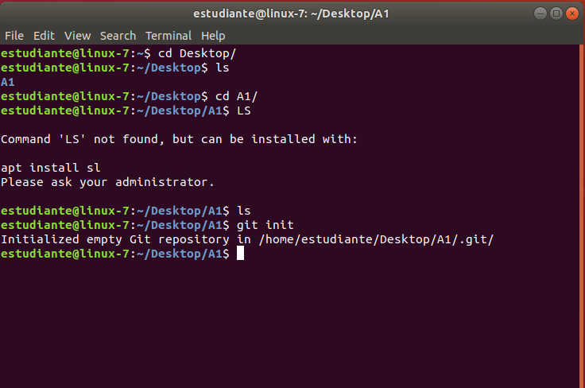
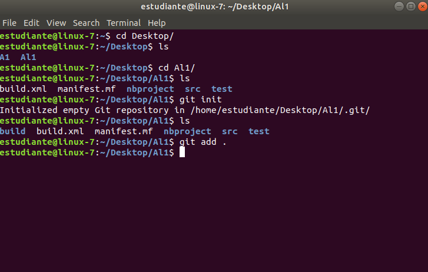
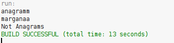
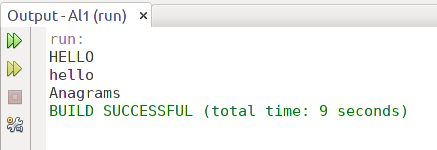

# Git Basic Concepts

# workshop1

# Anagrams

What is the purpose of this command?
- git add .
- git commit -m "Message"
- git push origin master
- git clone <repository>

Why we used it?
- git add .
- git commit -m "Message"
- git push origin master
- git clone <repository>

# End Of File

What that command does?
- git pull origin master
- 

# Maven Basic Concepts

