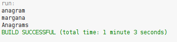

# Git Basic Concepts

# workshop1

# Anagrams

What is the purpose of this command?
- git add . ->The purpose is to register changes and add them to place them in git
- git commit -m "Message"->The purpose is to place the changes in the local copy
- git push origin master ->The purpose is to send the changes and replace them to master
- git clone <repository> ->he purpose creates a local copy of a repository

Why we used it?
- git add . -> It is used to add files to the index.
- git commit -m "Message"-> It is used to change the header, and the changes that are made do not affect the remote repository, you should always include a message as a brief description of what was modified.
- git push origin master -> It is used to send the changes that were made in the main one.
- git clone <repository> -> It is used to review repositories and to create local copies of a project.

# End Of File

What that command does?
- git pull origin master-> the command is used to join all the changes that have been made in the local repository.

# Maven Basic Concepts
- What do means the -B option in the command?, Run in non-interactive (batch) mode
- What do means the -D option in the command?, The representation of the directory and define a property of the system.
- What do means the groupId properties in the command?, All maven projects must belong to a project, where the name of the initial package of the project classes is placed.
- What do means the artifactId properties in the command?, It is the name that the project has, and with that each one is identified.

- Describe the content of the directory that has been created.-> contains a package of sources where the .java is placed, also contains a package of tests to verify how correct the code is, a package for other sources and the respective package of tests, then there is the package that has all the dependencies and the of dependencies for tests, and finally the folder where the pom.xml is located.

# POM file
- What do means the word SNAPSHOT in the version value?, Se refiere a una versión del proyecto que está en tiempo de desarrollo como un WORK-IN-PROGRESS.

- What is the purpose of the packing tag into the POM file?

- What is the purpose of the dependencies and dependency tags into the POM file?, The purpose is to avoid the need to discover and specify libraries that require their own dependencies through automatic inclusion.

# Build LifeCyrcles and Plugins

- Using the terminal execute the command mvn compile. Take the output screenshot.

What is this command using for? -> is used to compile the source code of the project.

What are transitive dependencies? -> It is a function that makes it easy to read the project files of your dependencies in the specified remote repositories. In general, all the dependencies of those projects are used in your project, like anything else that your parents' project or their dependencies, and so on.
With transitive dependencies, the included libraries can grow quite large quickly. There are additional functions that limit the dependencies that are included: Dependency mediation, Dependency management, Scope of dependence, Dependencies excluded, Dependencies optional.

- Using the terminal execute the command mvn package. Take the output screenshot.

What is this command using for? -> It is used to take the compiled code and package it in its distributable format, such as a JAR.

- Using the terminal execute the command mvn install. Take the output screenshot.

What is this command using for?-> It is used to install the package into the local repository, for use as a dependency in other projects locally

- Generate a new maven project in other folder using the maven command line tools, this project should has as groupId "edu.eci" and as artifactId "another-maven-project". Take the output screenshot.

# DEpendency Managment 
- Go to the MVNRepository and search fortika-core library. Add a new dependency to the POM file with the last version of this library.

It contains the interfaces and main classes of Tika, but none of the implementations of the analyzer.

